# homework-GRUB

Описание домашнего задания
---
1. Включить отображение меню Grub
2. Попасть в систему без пароля несколькими способами
3. Установить систему с LVM, после чего переименовать VG

* за качество скринов извиняюсь, отображалось у меня все более менее, а вот скрины будто размытые делаются :(
---
- Этап 1: Включить отображение меню Grub.

Для отображения меню редактируем конфигурационный файл
```bash
nano /etc/default/grub
```
В нем меняем параметры
```bash
#GRUB_TIMEOUT_STYLE=hidden
GRUB_TIMEOUT=10
### можно было бы еще сделать GRUB_TIMEOUT_STYLE=menu, тогда бы меню вылезало и ожидало
### или GRUB_TIMEOUT=-1   (-1 означает ждать бесконечно)
```

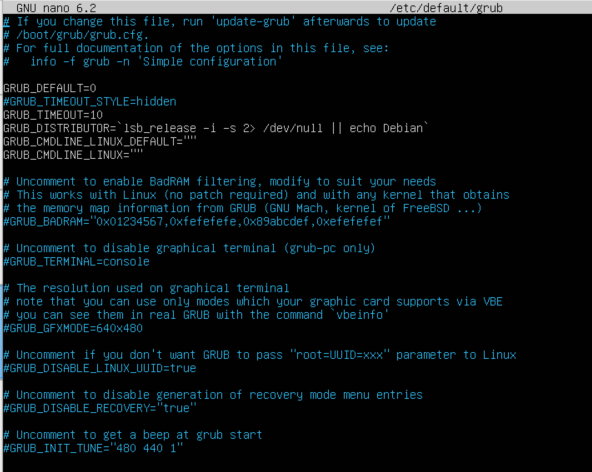


Обновляем конфигурацию загрузчика и рестартуем систему. получаем менюшку

```bash
update-grub
reboot
```

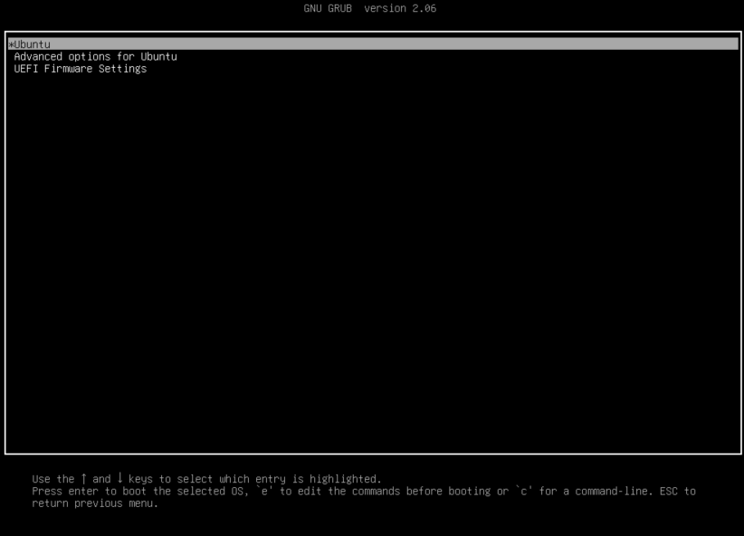

---
- Этап 2: Попасть в систему без пароля несколькими способами

Способ 1

В меню grub, которое получили в результате Этапа 1, переходим в advance опции и нажимаем на клавиатуре "е"

В конце строки, начинающейся с linux, добавляем init=/bin/bash (на скрине там стоит табулятор, строка в одном месте только)
Когда сменили, нажимаем сtrl-x

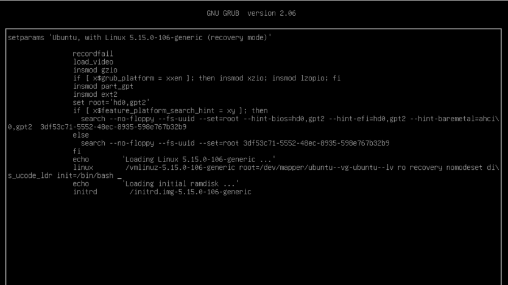

Результат - мы в системе под root. (примечание, по умолчанию у рута нет пароля)

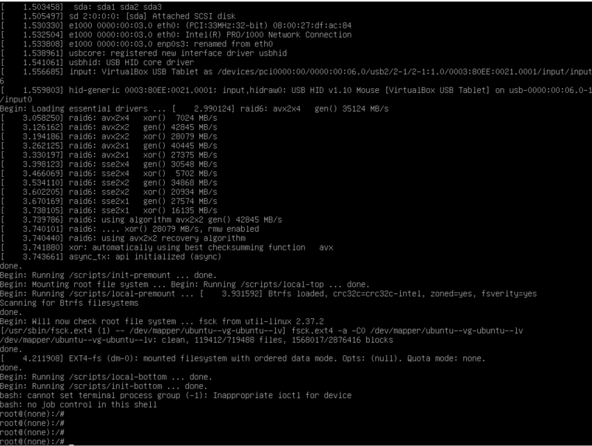

Способ 2

В меню загрузчика выбмраем второй пункт (Advanced options…), а после ....recovery mode

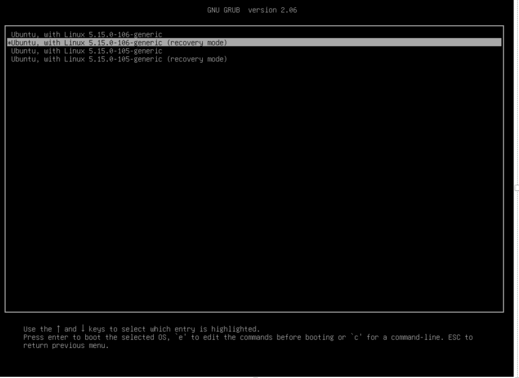

Чтобы файловая система перемонтировалась в режим read/write, можно воспользоваться удобным вариантом (чтобы не делать руками).
В открывшемся меню включаем поддержку сети, тогда режим read/write активируется.
* ПРИМЕЧАНИЕ До этого графика немного лагала, будто разметка уехала, но после изменения настроек сети все норм стало (заскринить не успел)

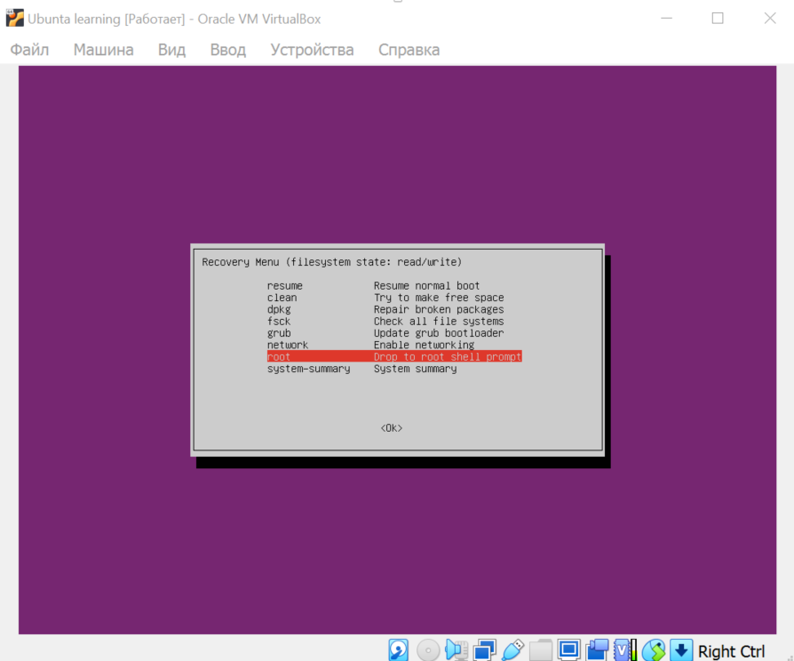


Далее выбираем root и....мы попали в систему под рутом (как то прям просто, ситуация с паролем такая же, дефолтного нет)

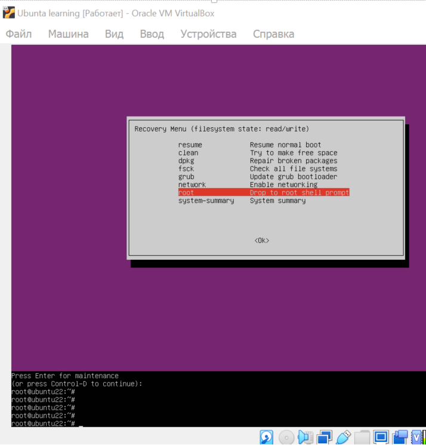

---
2. Установить систему с LVM, после чего переименовать VG

Сейчас установлена Ubuntu 22.04 со стандартной разбивкой диска с использованием  LVM

Прям не выходя из root, проверим текущее состояние

```bash
vgs
```

Переименовываем Volume Group

```bash
vgrename ubuntu-vg ubuntu-grub
```

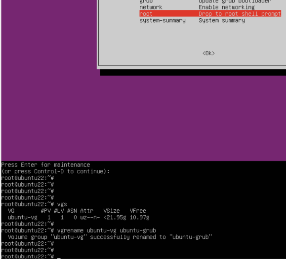


Далее нам надо внести изменения в /boot/grub/grub.cfg, заменив название на новое в нескольких местах
Файл большой, для своего удобства ищем, сколько всего таких записей в файле, чтобы ничего не упустить. (потупил немного, упустил, что там два дефиса) 

```bash
cat /boot/grub/grub.cfg | grep ubuntu--vg
```

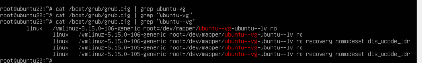

Меняем, проверяем, убеждаемся

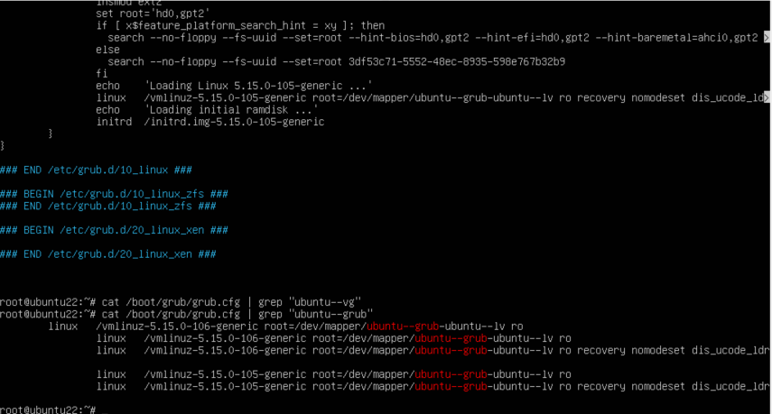


Ну и проверяем после перезагрузки системы

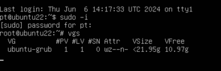


